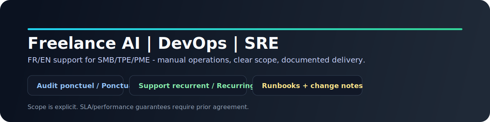

# Freelance AI | DevOps | SRE

Main site: https://pezzos.com

## EN

I help SMBs and small teams reduce manual operations with pragmatic AI, DevOps, and SRE work.

### What I Do

- `One-off audit`: identify bottlenecks in workflows, tooling, reliability, and delivery.
- `Implementation sprint`: deliver focused automation and safer operations.
- `Recurring support`: weekly or monthly follow-up to keep improvements reliable.

### Selected Open-Source Work

1. [cursor-openrouter-proxy](https://github.com/pezzos/cursor-openrouter-proxy) - OpenAI-compatible HTTP/2 proxy for Cursor with OpenRouter routing.
2. [remote-mcp-proxy](https://github.com/pezzos/remote-mcp-proxy) - Dockerized Go proxy exposing local MCP servers as remote endpoints.
3. [Whisper-to-Notion](https://github.com/pezzos/Whisper-to-Notion) - Voice capture flow to structured Notion entries via Whisper/GPT/Shortcuts.
4. [jsonl_dataset_generator](https://github.com/pezzos/jsonl_dataset_generator) - Multi-provider JSONL dataset draft generation for fine-tuning pipelines.
5. [PezzosCode](https://github.com/pezzos/PezzosCode) - Docs-first toolkit for deterministic AI-assisted delivery workflows.
6. [raycast-ai-assistant](https://github.com/pezzos/raycast-ai-assistant) - Raycast command suite for dictation and AI prompt workflows.

### Why Teams Work With Me

- Clear scope and practical execution.
- Traceable changes (runbooks, checklists, and written notes).
- Explicit limits, no inflated claims.

### Contact

- Website: https://pezzos.com
- GitHub: [@pezzos](https://github.com/pezzos)
- LinkedIn: [Alexandre Pezzotta](https://www.linkedin.com/in/alexandrepezzotta)

### Credibility Limits

- No legal, tax, or compliance certification service.
- No unconditional SLA or performance guarantee.
- Emergency and off-hours support require explicit prior agreement.
- Project examples are implementation snapshots, not universal outcome guarantees.

## FR

J'aide les TPE/PME et petites equipes a reduire les taches manuelles avec une approche pragmatique en IA, DevOps et SRE.

### Ce Que Je Fais

- `Audit one-off`: identifier les points de friction sur les workflows, outils, fiabilite et delivery.
- `Sprint d'implementation`: livrer des automatisations ciblees et des operations plus sures.
- `Accompagnement recurrent`: suivi hebdomadaire ou mensuel pour maintenir les gains dans la duree.

### Realisations Open Source Selectionnees

1. [cursor-openrouter-proxy](https://github.com/pezzos/cursor-openrouter-proxy) - Proxy HTTP/2 compatible OpenAI pour Cursor avec routage OpenRouter.
2. [remote-mcp-proxy](https://github.com/pezzos/remote-mcp-proxy) - Proxy Go dockerise exposant des serveurs MCP locaux comme endpoints distants.
3. [Whisper-to-Notion](https://github.com/pezzos/Whisper-to-Notion) - Flux de capture vocale vers des entrees Notion structurees via Whisper/GPT/Shortcuts.
4. [jsonl_dataset_generator](https://github.com/pezzos/jsonl_dataset_generator) - Generation de brouillons de jeux JSONL multi-provider pour des pipelines de fine-tuning.
5. [PezzosCode](https://github.com/pezzos/PezzosCode) - Toolkit docs-first pour des workflows de livraison IA assistes et deterministes.
6. [raycast-ai-assistant](https://github.com/pezzos/raycast-ai-assistant) - Suite de commandes Raycast pour workflows de dictee et prompts IA.

### Pourquoi Travailler Avec Moi

- Perimetre clair et execution concrete.
- Changements tracables (runbooks, checklists, notes ecrites).
- Limites explicites, sans promesse gonflee.

### Contact

- Site: https://pezzos.com
- GitHub: [@pezzos](https://github.com/pezzos)
- LinkedIn: [Alexandre Pezzotta](https://www.linkedin.com/in/alexandrepezzotta)

### Limites de Credibilite

- Pas de service de certification legale, fiscale ou compliance.
- Pas de garantie inconditionnelle de SLA ou de performance.
- Le support urgence et hors horaires requiert un accord explicite prealable.
- Les exemples projets sont des instantanes d'implementation, pas des garanties de resultat universel.
